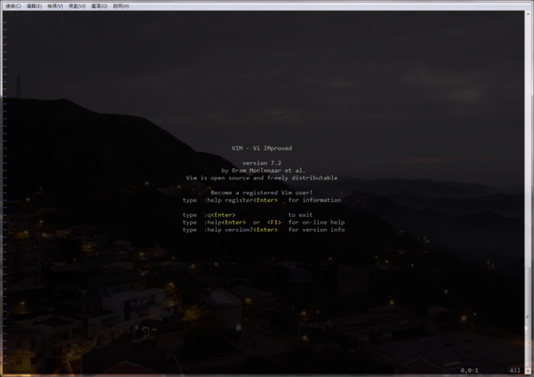
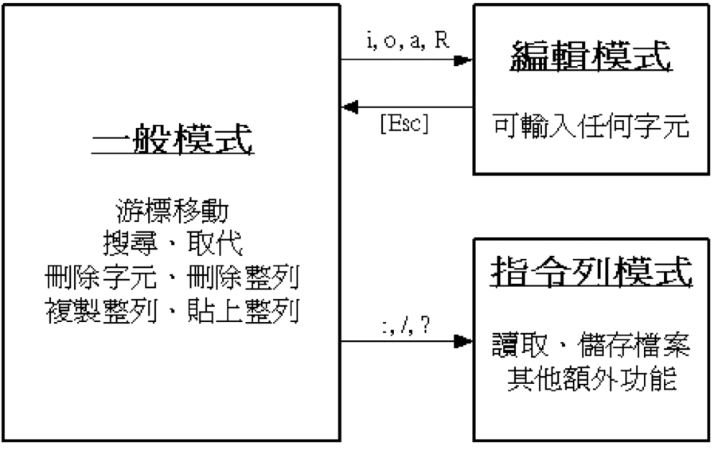
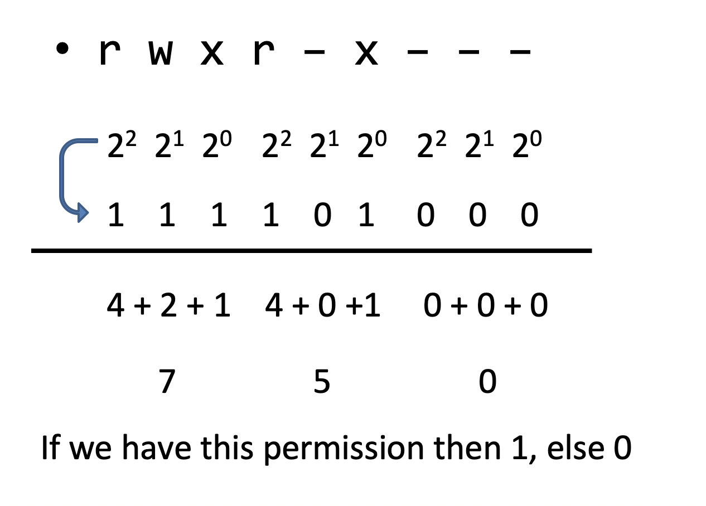

<style>
img[alt~="center"] {
  display: block;
  margin: 0 auto;
}
</style>
# Computer Programming 1 Lab
## 2020-09-17
---

# Rules - Assignments 
  - DO NOT CHEAT!
  - Both cheater and his partner will be punished.
  - Lock your assignment directory!
  - Discuss, BUT not copy.
  - Exercise will be announced in EVERY TA’s class.


--- 
# Rules - Mailing Convention 
  - Asking questions of TAs via e-mail
  - The subject of mail shall begin with **<span style="color:red;">[109cp1]</span>** and make it clear.
  - `Hi, my code doesn’t work` -----> (X) wrong subject.
  - `[109cp1] help!!` -----> (X) help what?
  - `[109cp1] for-loop did’t stop!` -----> (O) nice and clear !!
  - Include your signature
    - Remember to append your **studentID** and your **name** to the mail.

--- 
# Rules - Asking a Question in a Smart Way
### Before You Ask
- Try to find an answer by searching the archives of the FB Group or class resources.
- Try to find an answer by searching the Web.
- Try to find an answer by asking a skilled friend.
### When You Ask
- Use meaningful, specific subject headers
- Be explicit about your question
  - Have you tried any test? What problem you think you are facing?
  - **DON'T JUST PASTE YOUR CODE SNIPPETS.**
---
# Outline
- Basic Unix Command
- Basic Vim
- Lock directory
- Assignment
---
# Basic UNIX Command

0. Download [pietty](http://ntu.csie.org/~piaip/pietty/) **(Windows Only)**
1. Connect to `ghost.cs.nccu.edu.tw`
   **Windows**: Use Telnet first time, and use SSH afterwards.
   `telnet s109XX@ghost.cs.nccu.edu.tw`
   **MacOS**:
   `ssh s109XX@ghost.cs.nccu.edu.tw`
   > s109XX is your ID, the "XX" is the latest two digits of your StudentID
2. Enter your password 
   > It is normal for the password you entered not displaying on your window

---
# Basic UNIX Command

3. Change your password
  $ passwd
4. Activate your mail service
  $ elm
  then press 'y' three times and 'q' to finish
5. Setting your enviorment
  ```bash
  cp ~g10611/.profile . 
  cp ~g10611/.vimrc .  
  cp ~g10611/.bashrc .  
  exit
  ```
6. Connenct to `s109XX@ghost.cs.nccu.edu.tw` again **(Use SSH this time)**

---
# Basic UNIX Command
~   => your home directory 
~x => x’s home directory 
.    =>  current directory
..   =>  parent directory

**Absolute path**: Start with "/"

- /usr/share/bin
- /home1/student/stud107/s107xx

**Relative path**: Path relate to current directory.

- If current dir is /usr
  test/bin =>   /usr/test/bin
  li/public =>  /usr/li/public

---

# Basic UNIX Command

- `ls` list files in current directory.

```bash
ls
ls -l  # list files details in current directory.
ls -a  # list all files (include hidden files).
ls -la # Both of listing all files with details
```

---
# Basic UNIX Command

## How to create/delete/copy files or directories?

```bash
mkdir test 
# Create a directory named "test" in current directory
cp fileX dirY/dirZ
# Copy fileX from current directory to ./dirY/dirZ
cp fileX dirY/fileZ
# Copy fileX from current directory to dirY and rename to fileZ.
cp -r dirX dirY
# Copy dirX from current directory to dirY.
# If dirY doesn't exist, dirY is a copy of dirX.
# If dirY is a directory then there will be a copy of dirX under dirY.
```

---

# Basic UNIX Command

## How to create/delete/copy files or directories?

```bash
mv fileA dirB
# Move fileA to dirB.
mv dirA dirB
# If dirB exist, then move dirA under dirB.
# If dirB does not exist, dirA is rename to dirB.
rm fileA
# Remove file fileA (Only for file)
rm -r dirA
# Remove directory dirA and all its contents
```

---

# Basic UNIX Command - Your Round
1. Please create a directory named `1091cp1`
  `mkdir 1091cp1`
2. Enter directory `1091cp1`
  `cd 1091cp1`
3. Please create a directory named `abc`
  `mkdir abc`
4. Please rename `abc` to `xyz`
  `mv abc xyz`
5. Copy `xyz` and rename it as `jqk`
  `cp -r xyz cdf`
7. Please delete directory `xyz` and `jqk`
  `rm -r xyz jqk`

---

# Basic UNIX Command - Recap

- Use `mkdir` to create a directory
- Use `mv` to move a directory/file or rename a directory/file
- Use `cp` to copy a file and `cp -r` to copy a directory
- Use `rm` for removing file and `rm -r` for removing directory

---

# Basic UNIX Command - Others

- The path used on cp, mv, rm, mkdir can be absolute path or relative path.
- Use `pwd` to see what the current directory is.
- Use `whoami` to see your account's name.
- Use `logout` to logout the system. (or you can press Ctrl+D either)
- Type `Ctrl+L` to clean your screen
- Remember, whenever you have problems using Unix, try "man" command.

```bash
man ls
man cp
```

> man stands for manual.

---

# Basic Vim

- Vim is a text editor that you can write texts, codes just like `記事本`
- To use it, you just need to type `vim` with a filename folowing it, e.g. `vim test.txt`
  > If the file exists, Vim will create one. Otherwise, it will open it.



---

# Basic Vim

- Vim basically has three modes:
  - Normal Mode:
    - Navigate, Search, Replace, Copy, Paste
  - Insert Mode:
    - Typing
  - Command-Line Mode:
    - Read, Write File...
<style scoped>
img[alt~="right"] {
  display: block;
  margin: -160px 0 0 500px;
}
</style>


---

# Basic Vim

1. Vim starts in normal mode.
2. Press `i` to change to Insert mode.
3. Type some words…
4. Press `ESC` back to normal mode.
5. Press `:` or `/` to enter command-line mode. (Save, open file, search text, indenting…etc.)

<style>
img[alt~="upper-right"] {
  display: block;
  margin: -400px 0 0 600px;
}
</style>


---

# Basic Vim

1. In the normal mode of vim, press `i` to insert mode and type some texts.

2. When you have done our work, press `ESC` back to normal mode.

3. Then type `:w xxx.txt` to save our work to xxx.txt

4. Now type `:q` to exit vim.

6. `ls` your files to check if the `xxx.txt` exists

---

# Basic Vim - Others

- Use `:q!` to quit Vim forcibly no matter if you have written your files.
  > If you quit without saving your will get a warning
- Use `:x` or `:wq` to write your file and quit Vim with only one command.
- Use `:!` to commaand shell command in VI, e.g. `:!ls`
- Use `:xxx` to move cursor to the specific line.
  > xxx is the line number
---

# Basic Vim - Your Round

1. Please create a file named `abc.txt`
  `vim abc.txt`

2. Please insert “hello world” at line 3
  `i -> Enter Twice` -> Type `hello world`

3. Please save the file
  `:w`

4. Please quit the file
  `:q`

---

# How to Lock Your Directory?

1. Create a directory named `1091cp1` at your home directory

   ```bash
   mkdir ~/1091cp1
   cd ~
   ```

2. Enter `chmod -R 700 1091cp1` to lock your directory.

---

# How to Lock Your Directory?

In UNIX, There are three access levels?
- Owner => You
- Group => Accounts in the same group, say, stud109
- Others => Other guys…

## For each level, you can set it permissions:

- Read (r)
- Write (w)
- Execute (x)

---
# How to Lock Your Directory?

Take a look at following `ls -l` output:
- `g9803` is the <span style="color: red">owner</span>
- `grad98` is the <span style="color: red">group</span>
- The first letter will show `-` or `d` which are representing a `file` or a `directory` separately.
```bash
[g9803@ghost]~ ls -l 
總計 4
-rw-r--r-- 1 g9803 grad98   74 2010-02-04 02:15 100.in
drwxr-xr-x 3 g9803 grad98  512 2010-09-15 11:41 991cp1/
-rw-r--r-- 1 g9803 grad98  672 2010-02-04 00:04 acm100.c
-rw-r--r-- 1 g9803 grad98  507 2010-03-02 15:50 acronym.cpp
```

---
# How to Lock Your Directory?

- The following 9 letters like `rwxr-----` indicates the file's permission
- The first 3 letters indicate the permission of owner
  - In case `rwx`, it means user `g9803` can read, write, and execute
- The middle 3 letters indicate the permission of group
  - In case `r--`, it means the users in group `grad98` only can read
- The last 3 letters indicate the permission of others
  - In case `---`, it means others' permission is none.

```bash
[g9803@ghost]~ ls -l 
總計 4
-rw-r--r-- 1 g9803 grad98   74 2010-02-04 02:15 100.in
drwxr-xr-x 3 g9803 grad98  512 2010-09-15 11:41 991cp1/
-rw-r--r-- 1 g9803 grad98  672 2010-02-04 00:04 acm100.c
-rw-r--r-- 1 g9803 grad98  507 2010-03-02 15:50 acronym.cpp
```

---
# How to Lock Your Directory?


---
# Assignment 0

1. Go to [NCCU OJ Website](https://oj.mozix.ebg.tw/)
2. Click `Contests` on the menu.
3. Click the assignment you want to submit (In this week, the assignment is `Assignment 0`)
4. Click `Problems` in the right panel
5. Click the problem
6. You could edit the code in VIM, then paste your code at the submit area.
7. Click `Submissions` in the right panel to check if you have submitted successfully.

---
<!-- 
  backgroundImage: "linear-gradient(to bottom, #67b8e3, #0288d1)"
-->
<style scoped>
  a {
    color: #efefef;
  }
</style>

# <!--fit-->[Join FB Group](https://www.facebook.com/groups/208163379209304/)
---
<!-- 
  backgroundImage: "linear-gradient(to bottom, #67b8e3, #0288d1)"
-->
<style scoped>
  h1, h2 {
    color: #efefef;
  }
</style>
# <!--fit--> Any Question?
## <!--fit--> Course? Assignment? Exercise? TA?
