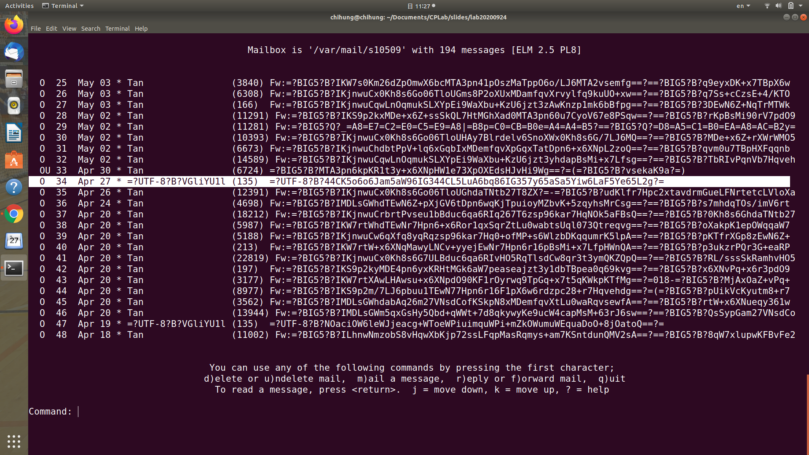
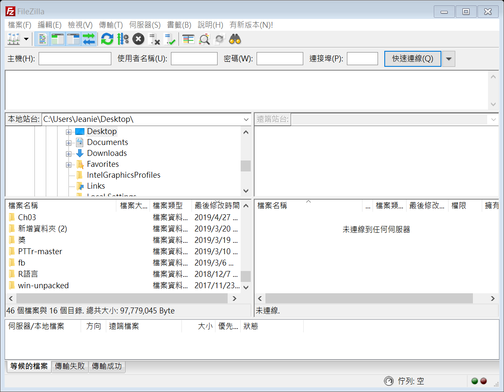
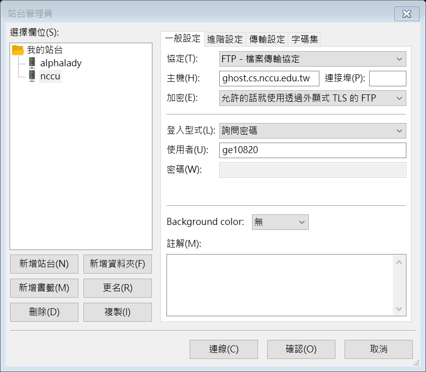
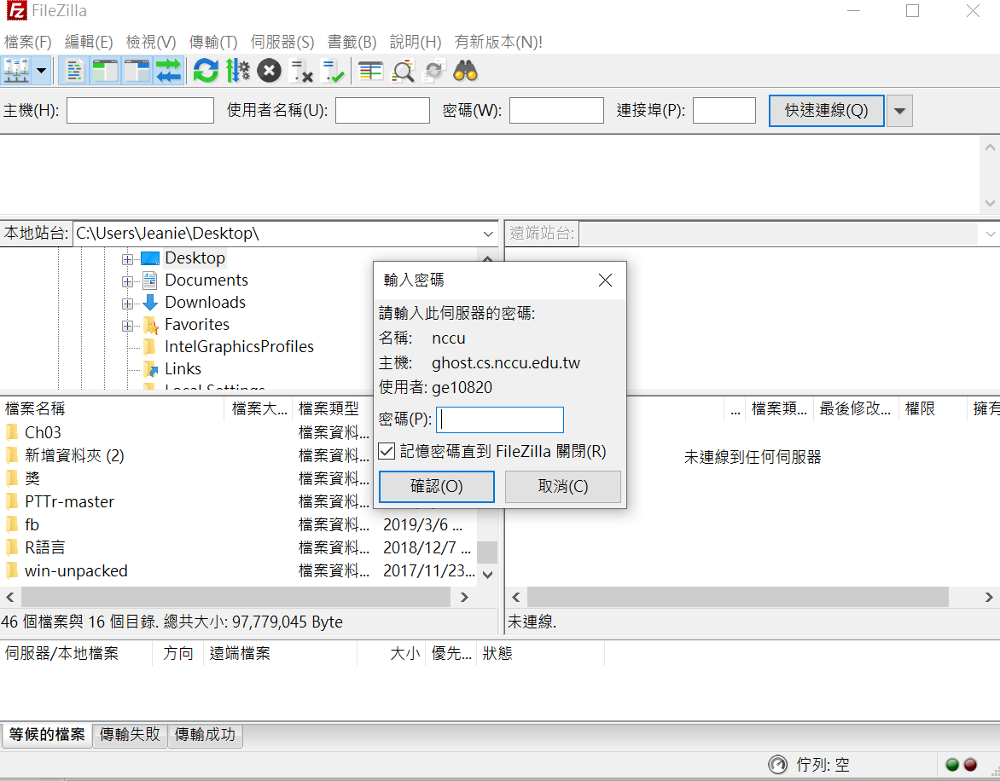
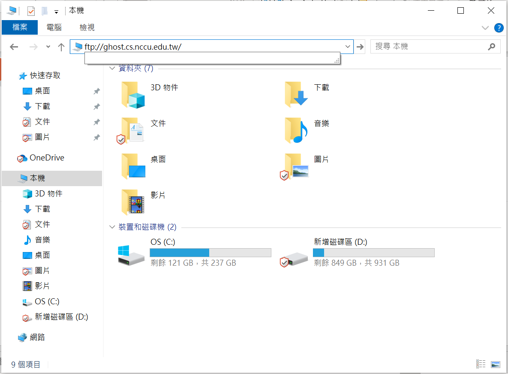
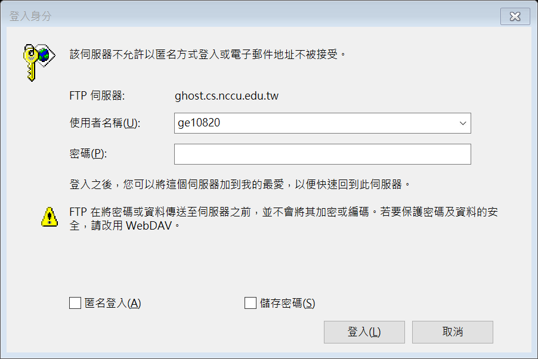
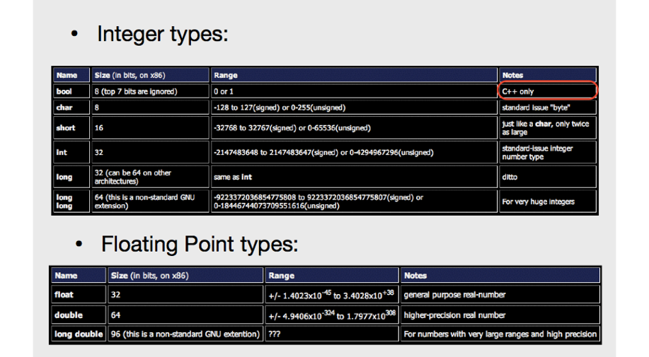
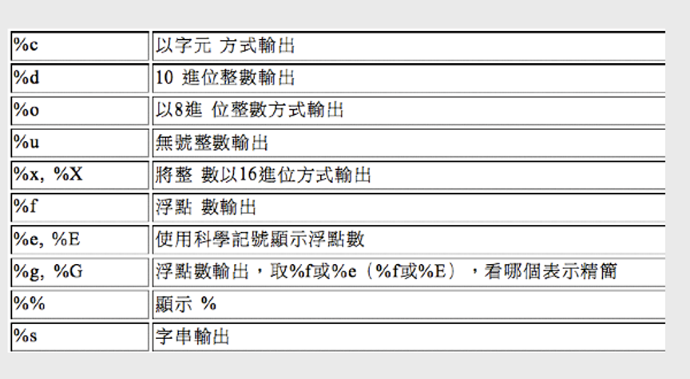

# Computer Programming 1 Lab
## 2020-09-24
Chang, Chi-Hung

---

# Outline
- Unix Command Review
- Vim Tips
- Simple C Program
- Compile Your Program
- How to Copy Your C Program?
- Data Type
- Operators in C
- Exercise 1

---

# Unix Command Review
`cd` -> change directory
```bash
cd ~
cd ~s109xx/test
cd public_html
cd /usr/share
cd ..
cd ../test
```

---

# Unix Command Review
`ls` -> list files in current directory
```bash
ls
ls -l   -> list files details in current directory
ls -a   -> list all files (include hidden files) in current directory
ls -la  -> list all files with details in current directory
```

---

# Unix Command Review
How to create/delete/copy files or directory?
- `mkdir test`
    Create a directory named "test" in current directory.
- `cp fileX dirY/dirZ`
    Copy fileX from current directory to `./dirY/dirZ`.
- `cp fileX dirY/fileZ`
    Copy fileX from current directory to dirY and rename to fileZ.
- `cp -r dirX dirY`
    Copy dirX from current directory to dirY.

---

# Unix Command Review
How to create/delete/copy files or directory?
- `mv fileA dirB`
    Move fileA to dirB.
- `mv dirA dirB`
    - If dirB exists, then move dirA under dirB.
    - If dirB doesn't exist, dirA is renamed to dirB.
- `rm x`
    Remove file x or remove directory x if x is an empty directory.
- `rm -rf x`
    Remove directory x and all its contents regardless the file is write-protect or not.

---

# Unix Command Review
- The path used on `cd`, `mkdir`, `cp`, `mv`, and `rm` can be absolute path or relative path.
- Type `pwd` to see what the current directory is.
- Type `whoami` to see your account's name.
- Type `logout` to logout the system, or you can press `Ctrl+D`.
- Type `Ctrl+L` to clean your screen.
- Type `Ctrl+C` to stop the program which is running.

---

# Unix Command Review
- Remember, whenever you have problems using Unix, try `man` command.
    ```bash
    man ls
    man cp
    ```
- `man` stands for manual.

---

# Unix Command Review
`elm` -> an screen-oriented mailer program

[more source](https://www.computerhope.com/unix/uelm.htm)

---

# Vim Tips
- `i`, `o`, `a`, `R` -> change to insert mode
- `Esc` -> back to normal mode
- `:`, `/` -> enter command-line mode
- `:w` -> save your work
- `:q` -> quit vim
- `:wq`, `:x` -> save and quit
- `:q!` -> quit without saving
- `:xxx` -> go to line xxx
- `/xxx` -> search "xxx" in this file

---

# Vim Tips
- `v` -> character visual
- `V` -> line visual
- `y` -> copy
- `p` -> paste
- `d` -> delete (cut)
- `u` -> undo
- `:nohl` -> no highlight
- `gg=G` -> auto indent

---

# Simple C Program
- `main()` is a entry point of program
    ```c
    #include <stdio.h>

    int main(){
        int x;
        scanf("%d", &x);
        x = x + 2;
        printf("%d\n", x);
        return 0;
    }
    ```
    - `#include <stdio.h>` is for preprocessor
    - `int main(){...}` -> main function
    - `scanf` -> input
    - `printf` -> output
    - `return 0` -> no error

---

# Compile Your Program
How to compile your program?
- `make` if you have `Makefile`.
    - Like a script. It runs `gcc` automatically.
- `gcc`, GNU compiler.
    ```bash
    gcc xxxxx.c
    ```
    - It will compile `xxxxx.c` and generate the executable file `a.out`.
    - Or dump a lot of errors.

---

# Compile Your Program
```c
#include <stdio.h>

int main(){
    int a;
    printf("%d", a)
    return 0;
}
```
```bash
[ge10919@ghost]~ gcc test.c
test.c: In function 'main':
test.c:5: error: excepted ';' before 'return'
```

---

# Compile Your Program
Type `./a.out` to run the program.
```bash
[ge10919@ghost]~ ./a.out
134511260
```
- Here is a "initialization" problem.

---

# How to Copy Your C Script?
- [filezilla](https://filezilla-project.org/download.php?show_all=1)


---

# How to Copy Your C Script?
- filezilla
    - ghost.cs.nccu.edu.tw
    - Your Ghost account


---

# How to Copy Your C Script?
- filezilla
    - Your Ghost password


---

# How to Copy Your C Script?
- ftp://ghost.cs.nccu.edu.tw **(Windows UI)**


---

# How to Copy Your C Script?
- ftp://ghost.cs.nccu.edu.tw **(Windows UI)**


---

# How to Copy Your C Script?
- `ftp s109XX@ghost.cs.nccu.edu.tw` **(command line)**
    - `ls` -> list files or directories on server
    - `pwd` -> see what the current directory is on server
    - `cd` -> change directory on server
    - `lls` -> list files or directories on local
    - `lcd` -> change directory on local
    - `get` -> copy the file from server to local
    - `mget` -> copy more files from server to local
    - `put` -> copy the file from local to server
    - `mput` -> copy more files from local to server
> [more source](https://www.opencli.com/linux/linux-ftp-command)

---

# How to Copy Your C Script?
- `cat` is a standard Unix utility that reads files sequentially, writing them to standard output.
    ```bash
    [ge10919@ghost]~ cat hello_world.c
    #include <stdio.h>

    int main(){
        printf("Hello World!\n");
        return 0;
    }
    [ge10919@ghost]~ 
    ```

---

# Data Type


---

# Data Type
- `printf`/`scanf` format specifier


---

# Data Type
- Type Conversion
    - Implicit type conversion
        ```c
        double number = 10;
        printf("%f\n", number/3);
        ```
    - Conversion
        ```c
        int num = 3;
        float fnum = 3.5;
        float sum;
        sum = (float)num + fnum;
        ```

---

# Data Type
- Print float or double number
    - Number of digits
        ```c
        double pi = 3.1415926;
        printf("%d\n", pi);
        // 3

        printf("%f\n", pi);
        // 3.1415926

        // What if I want to print "3.14"?
        printf("%.2f\n", pi);
        // 3.14
        ```

---

# Operator in C
- Arithmetic Operator
    - `+`, `-`, `*`, `/`
        - Example: `x = a + b`

    - `%`
        - Module Operator and remainder of after an integer division.
        - Example: `z = x % y`

    - `++`, `--`
        - Increase/Decrease operator increases/decreases the integer value by one
        - Example: `i++`, `j--`

---

# Operator in C
- Relational Operator
    - `==`, `!=`
        - Checks if the values of two operands are equal or not.
        - Example: `a == b`, `x != y`
    - `>`, `<`
        - Checks if the value of left operand is greater/less than the value of right operand.
        - Example: `a > b`, `c < d`
    - `>=`, `<=`
        - Checks if the value of left operand is greater/less than or equal to the value of right operand.
        - Example: `a >= b`, `c <= d`

---

# Operator in C
- Logical Operator
    - `&&`
        - Called Logical AND operator.
        - Example: `A && B`
    - `||`
        - Called Logical OR operator.
        - Example: `A || B`
    - `!`
        - Called Logical NOT operator.
        - Example: `!(A && B)`

---

# [Exercise 1](https://oj.mozix.ebg.tw/contest/8)
There is a rectangle in plane coordinates. Give you the coordinates of the upper-left and bottom-right points of the given rectangle. Please calculate the area of the rectangle.

- Input:
    Two lines. Each line contains two numbers.
    The two numbers in the first line are the coordinate of the upper-left point $(x_1, y_1)$. The two numbers in the secend line are the coordinate of the bottom-right point $(x_2, y_2)$.
- Output:
    The area of the rectangle.

---

# Any Questions?
