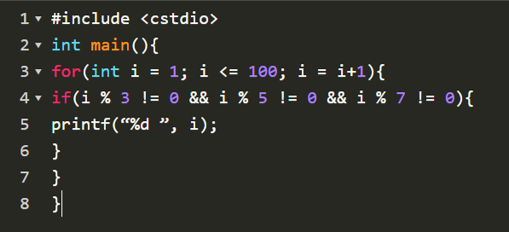
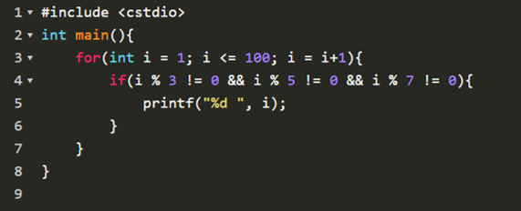
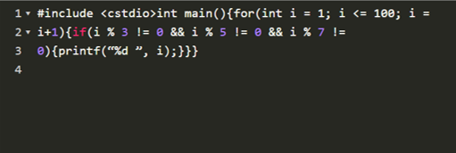

# Computer Programming 1 Lab
## 2020-10-15


---

# Outline
- How to fix the bug ?
- How to prevent the bug ?
- Scope
- Recursive & Loop
- "EOF"
- Exercise 4

---

# How to fix the bug ?

---

# How to fix the bug ?
- ~~為甚麼範例測資都對，可是傳上 OJ 都錯~~
- ~~我覺得我的程式應該要這樣，但是怎麼跑出來的結果不一樣~~
- ~~為什麼我改了好幾次之後，還是不能 AC~~
- ~~我覺得我寫的是對的，爛測資~~

---

# How to fix the bug ?
- 重新審視自己的 code，看看有沒有邏輯不順，或是跟自己想法相左的地方
- 想一想，題目的輸入是不是有漏考慮的地方
- 想一想，自己的程式會不會在極端的條件下產生錯誤
- 自己想測資玩玩看自己的程式，玩著玩著，就修好了
- 找同學順自己的 code，將自己程式的邏輯清楚的表達一遍
- 去睡個覺，起床就會看到哪裡出毛病了
- 重新寫一遍

---

# How to fix the bug ?
## 黃色小鴨 Debug 法

<style>
img{
  display: block;
  margin: auto;
}
</style>


---

# How to prevent the bug ?

---

# How to prevent the bug ?
- 養成良好的排版習慣
- 有意義的變數名稱
- 上註解
- 多多練習 XD

---

# How to prevent the bug ?
## 養成良好的排版習慣 - 縮排


---

# How to prevent the bug ?
## 養成良好的排版習慣 - 縮排


---

# How to prevent the bug ?
## 養成良好的排版習慣 - 換行


---

# How to prevent the bug ?
## 養成良好的排版習慣 - 換行


---

# How to prevent the bug ?
## 有意義的變數名稱

- ~~a, b, c, d...~~

|            |      |            |      |
|------------|------|------------|------|
| Answer     | ans  | String     | str  |
| Array      | arr  | Pointer    | ptr  |
| Count      | cnt  | Current    | cur  |
| Initialize | init | Temporaty  | tmp  |


---

# Scope
## 變數生命週期

---

# Scope
## 變數生命週期

- 一個變數只會存在於離他最接近的{}中
- {}與{}中若有相同的變數，則取用最接近的變數

---

# Scope
## 變數生命週期
```c
    int main(void){
        int i = 456;
        for(int i=0;i<100;i++){
            for(int j=0;j<100;j++){
                int i = j+1;
            }
        }
        return 0;
    }
```

---

# Scope
## 變數生命週期

- 強烈建議變數不要重複命名，否則容易搞混

---

# Recursive & Loop

---

# Recursive & Loop
## 費氏數列 Loop 版本
```c
    int a = 0, b = 1;
    for(int i=0;i<100;i++){
        int tmp = b;
        b = a + b;
        a = tmp;
        printf("%d ",a);
    }
```

---

# Recursive & Loop
## 費氏數列 Recursive 版本
```c
    int fabo(int n){
        if(n == 1 || n == 2)
            return 1;
        return fabo(n-1) + fabo(n-2);
    }
```

---

# Recursive & Loop
## 費氏數列 Recursive 優化版本
```c
    int fabonacci[100] = {0, 1, 1};
    int fabo(int n){
        if(fabonacci[n] != 0)
            return fabonacci[n];
        fabonacci[n] = fabo(n-1) + fabo(n-2);
        return fabonacci[n];
    }
```
---

# Recursive & Loop
## 輾轉相除法 Loop 版本
```c
    int a = 6, b = 8;
    while(a != 0 && b != 0){
        if(b > ａ)
            swap(a, b);
        a = a%b;
    }
```

---

# Recursive & Loop
## 輾轉相除法 Recursive 版本
```c
    int gcd(int a, int b){
        if(b == 0)
            return a;
        return gcd(b, a%b);
    }
```

---

# Recursive & Loop 
## 推薦題目

- [計算冪](https://oj.mozix.ebg.tw/problem/45) *
- [費氏數列](https://oj.mozix.ebg.tw/problem/8)
- [環型填字](https://oj.mozix.ebg.tw/problem/27) *
- [就是勾不到箱子](https://oj.mozix.ebg.tw/problem/7)
- [Eva 的回家作業](https://oj.mozix.ebg.tw/problem/3)
- [G.C.D.最大公因數](https://oj.mozix.ebg.tw/problem/16)
- [高次方計算(Power of X)](https://oj.mozix.ebg.tw/problem/47) *

---

# EOF

---

# EOF

- "End Of File" 的縮寫

``` c
    int n;
    while(scanf("%d", &n) != EOF){
        //...
    }
```

---

# [Exercise 4](https://oj.mozix.ebg.tw/contest)
計算多個數之間的最小公倍數n, 保證 n $\leq 2^{31}-1$
 

- Input:
    給定多個整數, 輸入直到 "EOF"
- Output:
    給定多個整數, 輸入直到 "EOF"


---
<!-- 
  backgroundImage: "linear-gradient(to bottom, #67b8e3, #0288d1)"
-->
<style scoped>
  h1, h2, {
    color: #efefef;
  }
</style>
# <!--fit--> Any Question?