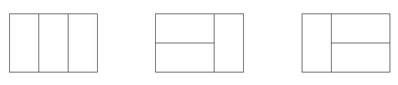

# Computer Programming 1 Lab
## 2020-11-19

---

# Outline
- Pointer
- recursive function
- Exercise 7

---

# Pointer

---

# Pointer
- **Array**
```c
int arr[10];

printf("%d", arr[5]);
printf("%d", *(arr+5));
```
---


# Pointer
- **2D Array**
```c
int arr[10][10];

printf("%d", arr[2][3]);
printf("%d", *(*(arr+2)+3));
```
---

# Pointer
## malloc

---
# Pointer
## malloc
- 標頭檔 #include <stdlib.h>
- 使用方法

    資料型態 *Ptr;
    Ptr = (資料型態*)malloc(sizeof(資料型態) * 數量)

---

# Pointer
## malloc
```c
int arr[10];
int *arrPtr = (int*)malloc(sizeof(int) * 10);

printf("%d", arr[5]);
printf("%d", *(arrPtr+5));
```

---

# Pointer
## malloc
```c
int *arrPtr = (int*)malloc(sizeof(int) * 10);
bool *arrPtr1 = (bool*)malloc(sizeof(bool) * 10);
short *arrPtr2 = (short*)malloc(sizeof(short) * 10);
float *arrPtr3 = (float*)malloc(sizeof(float) * 10);
double *arrPtr4 = (double*)malloc(sizeof(double) * 10);
long long *arrPtr5 = (long long*)malloc(sizeof(long long) * 10);
unsigned long long *arrPtr6 = (unsigned long long*)malloc(sizeof(unsigned long long) * 10);
```

---

# Pointer
## malloc
```c
int *arrPtr = malloc(sizeof(int) * 10);

//養成習慣，用完要還回去
free(arrPtr);
```

---

# Pointer
## malloc
```c
int arr2D[2][3];

int **arr = (int**)malloc(sizeof(int*) * 2);
for (int i = 0; i < 2; i++) 
    *(arr+i) = (int*)malloc(sizeof(int) * 3); 

printf("%d", *(*(arr+1)+2));
```

---

# Pointer
## malloc
```c
int arr2D[2][3];

int **arr = (int**)malloc(sizeof(int*) * 2);
for (int i = 0; i < 2; i++) 
    *(arr+i) = (int*)malloc(sizeof(int) * 3); 

//養成習慣，用完要還回去
for(int i = 0; i < 2; i++) {
    free(*(arr+i));
}
free(arr); 
```

---

# Recursive Function

---

# Recursive Function
- fibonacci
```c
int  fib(int n){
    if(n == 0 || n==1)
        return 1;
    else return fib(n-1) + fib(n-2);
}
```

---

# Recursive Function
## Practice
- 貼磁磚
- 你想知道用1×2的磁磚貼滿2×n的牆壁有幾種方式。


---

# Recursive Function
## Practice
- 貼磁磚
- 你想知道用1×2的磁磚貼滿2×n的牆壁有幾種方式。
```c
int ans[1000]={0,1,2};
int solve(int n){
    if(n<2)
        return ans[n];
    return ans[n-1] + ans[n-2];
}
```

---

# Recursive Function
## Practice
- 計算冪
- 給定兩個數字n, k，求n^k

---

# Recursive Function
## Practice
- 計算冪
- 給定兩個數字n, k，求n^k
```c
int mypow(int n, int k){
    if(m == k)
        return n;
    else if(m%2 == 0)
        return mypow((n*n), m/2);
    else
        return (mypow((n*n), m/2)*n);
}
```

---

# [Exercise 7](https://oj.mozix.ebg.tw/contest/38)

---

# Any Questions?
