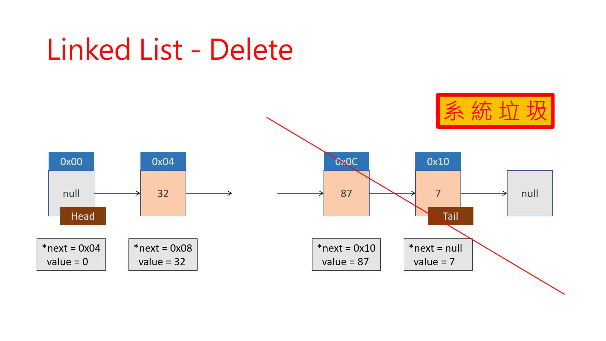

# Computer Programming 1 Lab
## 2020-12-10
簡傑

---

# Outline
- Quick Sort
- Linked List
- Exercise 10
- Homework

---

# Quick Sort

---

# Quick Sort
## Your Sort ?
```c
#define N 10

int array[N];
for(int i=0;i<N;i++)
    for(int j=0;j<N;j++)
        if(array[i] > array[j])
            swap(array[i], array[j]);
```

---

# Quick Sort
## How to use
- you need to #include <stdlib>
    ```c
    #define N 10

    int main(void){
        int array[N];
        // Only one line !!! 
        qsort((void *)array, N, sizeof(int), compare);
    }
    ```

---

# Quick Sort
## Compare Function
- you need to #include <stdlib>
    ```c
    int compare(const void *a, const void *b){
        int A = *(int *)a;
        int B = *(int *)b;
        if(A < B)
            return -1; //傳回 -1 代表 a < b
        else if(A == B)
            return 0; //傳回 0 代表 a = b
        else 
            return 1; //傳回 1 代表 a > b
    }

    ```

---

# Quick Sort
## Compare Function
- you need to #include <stdlib>
    ```c
    #define N 10

    int compare(const void *a, const void *b){
        int A = *(int *)a;
        int B = *(int *)b;
        // Oh !!!
        return A - B;
    }

    int main(void){
        int array[N];
        qsort((void *)array, N, sizeof(int), compare);
    }
    ```

---

# Quick Sort
## Compare Function
- you need to #include <stdlib>
    ```c
    #define N 10

    int compare(const void *a, const void *b){
        // Oh my Jesus
        return *(int *)a - *(int *)b;
    }

    int main(void){
        int array[N];
        qsort((void *)array, N, sizeof(int), compare);
    }
    ```

---

# Quick Sort
## Quick Sort in String
```c
#define N 10

int cmp(const void *a, const void *b){
    return strcmp((char *)a, (char *)b);
}

int main(void){
    char Dic[N][20];
    qsort((void *)Dic, N, sizeof(Dic[0]), cmp);
}
```
---

# Quick Sort
## Quick Sort in Struct

```c
#define N 10
typedef struct pikachu{
    int Attack;
    int Defense;
} Pikachu;

int cmp(const void *a, const void *b){
    Pikachu A = *(Pikachu *)a;
    Pikachu B = *(Pikachu *)b;
    return A.attack - B.attack;
}

int main(void){
    Pikachu Pikachus[N];
    qsort((void *)Pikachus, N, sizeof(Pikachus[0]), cmp);
}
```

---


---

# Linked List


---

# Linked List
## Node 節點

- 構成串列的最小單位
    ```c
    typedef struct node Node;

    struct node{
        int value;
        Node *next;
    };

    ```

---

# Linked List

```c
typedef struct node Node;

struct node{
    int value;
    Node *next;
};

Node head;

int main(void){
    // create a node
    Node *tmp = malloc(sizeof(Node));
    tmp -> value = 10;
    tmp -> next = NULL;
    // add first node
    head->next = tmp;
    printf("%d\n", head.next->value);
    // clear
    free(head.next);
}
```

---


---


---


---


---


---


---


---


---



---


---


---


---


---


---


---


---


---


---


---


---


---


---


---


---


---
# Exercise 10
我還沒出

---

# Homework
- 聽說有一款比神來也麻將還好玩的手遊叫神魔之塔，大家有興趣可以去玩看看

---
<!-- 
  backgroundImage: "linear-gradient(to bottom, #67b8e3, #0288d1)"
-->
<style scoped>
  h1, h2, {
    color: #efefef;
  }
</style>
# <!--fit--> Any Question?
